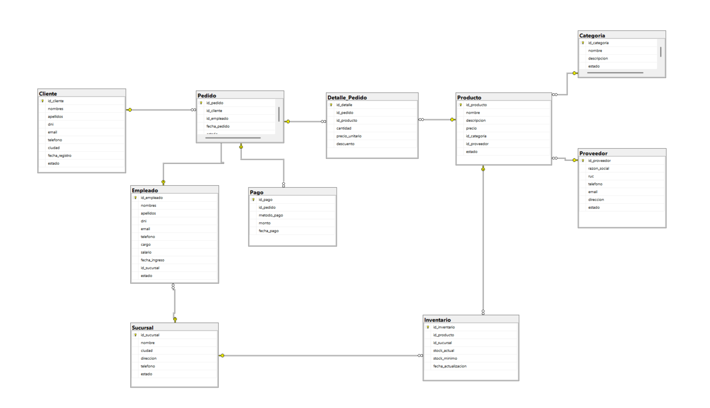

# Sistema de Gestión de Ventas - SQL Server

Proyecto de base de datos relacional desarrollado en **SQL Server** para gestionar clientes, productos, pedidos, pagos, empleados, sucursales, proveedores e inventario.

El proyecto fue desarrollado y presentado en un contexto académico, aplicando conceptos de modelado relacional, consultas SQL, vistas, funciones, procedimientos almacenados, triggers, transacciones y manejo de errores.

## Tecnologías utilizadas

- SQL Server
- SQL Server Management Studio (SSMS)
- T-SQL

## Funcionalidades principales

- Registro y gestión de clientes
- Gestión de empleados y sucursales
- Gestión de productos, categorías y proveedores
- Registro de pedidos y detalle de ventas
- Registro de pagos
- Control de inventario por producto y sucursal
- Verificación automática de stock
- Descuento automático de stock mediante triggers
- Consultas para análisis de ventas
- Vistas y funciones reutilizables
- Procedimientos almacenados
- Transacciones con `COMMIT` y `ROLLBACK`
- Manejo de errores con `TRY`, `CATCH` y `THROW`
- Carga masiva de datos para pruebas
- Backup de la base de datos

## Diagrama de la base de datos

La relación principal del sistema sigue el flujo:

**Cliente → Pedido → Detalle_Pedido → Producto**

Además, el sistema relaciona empleados, sucursales, pagos, categorías, proveedores e inventario.

## Consultas implementadas

Se desarrollaron consultas para analizar información como:

- Producto más vendido
- Clientes con mayor cantidad de pedidos
- Total comprado por cliente
- Ventas por empleado
- Ventas por sucursal
- Productos con stock bajo
- Ventas por método de pago
- Categorías más vendidas
- Pedidos según estado
- Ranking de productos por ingresos

También se utilizaron técnicas como:

- `INNER JOIN`
- `LEFT JOIN`
- Subconsultas
- CTE
- `GROUP BY`
- `HAVING`
- `ROW_NUMBER()`
- `RANK()`
- `LAG()`
- `SUM() OVER()`

## Automatización con triggers

Se implementaron triggers para automatizar procesos relacionados con el inventario.

Cuando se registra una venta, el sistema identifica el producto y la sucursal, verifica si existe stock suficiente y, si la operación es válida, descuenta automáticamente la cantidad vendida.

Si no existe suficiente stock, se genera un error y la operación puede revertirse mediante una transacción.

## Transacciones

Las operaciones críticas de venta fueron implementadas mediante transacciones.

- `COMMIT` confirma los cambios cuando todo se ejecuta correctamente.
- `ROLLBACK` deshace los cambios si ocurre un error.

Esto evita que un pedido, detalle de venta o pago quede registrado de manera incompleta.

## Documentación del proyecto

La explicación completa del desarrollo y presentación del proyecto se encuentra en el siguiente documento:

[Ver presentación del proyecto](DB_GestionVentas_Presentacion.pdf)

## Archivos principales

- `CrearBaseDatos.sql`
- `CrearTablas.sql`
- `InsertarDatos.sql`
- `Consultas.sql`
- `Vistas.sql`
- `Funciones.sql`
- `Procedimientos.sql`
- `Triggers.sql`
- `Transacciones.sql`
- `CargaMasivaDatos.sql`
- `Backups.sql`

## Autor

**Jostyn Mendoza**

Proyecto académico y de portafolio orientado al desarrollo de habilidades en SQL Server y análisis de datos.
